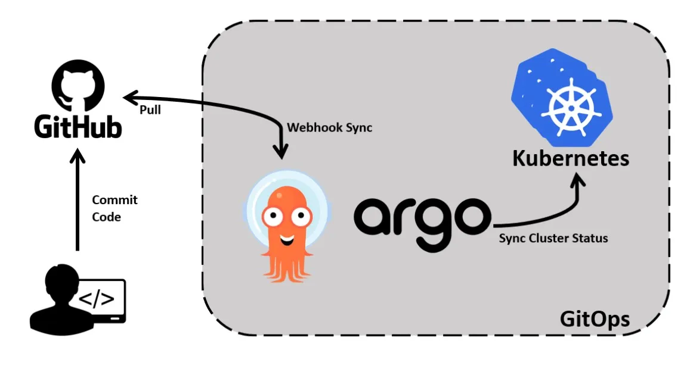
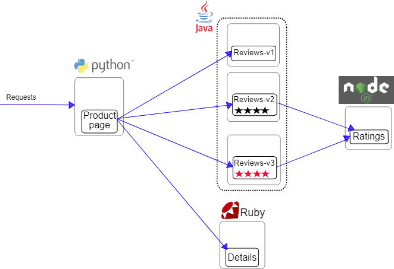

# Bookinfo App

## Overview

The Bookinfo App is a microservices-based application deployed on AWS EKS, utilizing Istio service mesh for traffic management, monitoring, and observability. This project demonstrates advanced Kubernetes orchestration and deployment strategies, complete with visualization tools like Prometheus, Grafana, and Kiali.

---

---

### Key Components:
- **AWS EKS**: Managed Kubernetes for scalable microservices orchestration.
- **Istio**: Service mesh for traffic management and monitoring.
- **ArgoCD**: GitOps continuous delivery.
- **Kiali**: Service mesh observability.
- **Prometheus & Grafana**: Monitoring and visualizing metrics.
- **GitHub**: Version control and CI/CD workflows.
- **kubectl**: CLI tool for Kubernetes management.

---

## Features

- **Traffic Management**: Intelligent routing and fault injection using Istio.
- **Observability**: Metrics visualization via Grafana and Kiali.
- **Continuous Deployment**: Automated pipelines with ArgoCD.
- **Scalable Microservices**: Deployed on AWS EKS with Istio.

---

## Screenshots

---

## Contribution

Feel free to fork and submit pull requests. Contributions are welcome!

---

## License

This project is licensed under the MIT License.

---
